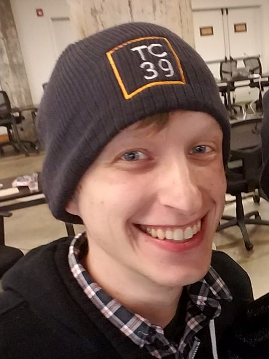

## Bio (Short)
Brian Terlson works at Microsoft on JavaScript, TypeScript, and Chakra. Editor of the ECMAScript standard.

## Bio (Long)
Brian Terlson works at Microsoft on the things that he loves most: JavaScript, open source, and standards. Brian helps design the ECMAScript language and represents Microsoft at Ecma's TC39 meetings and has been the editor of the ECMAScript standard since ES2016. Brian also works on TypeScript and helps build the open-source JavaScript engine ChakraCore.

## Images

